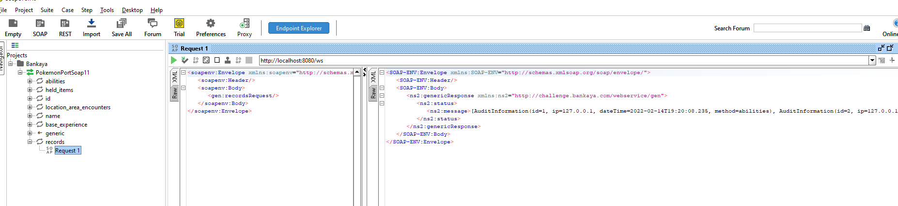

# Pokemon API

## General information

Challenge application designed to get information from [pokeAPI](https://pokeapi.co/) based on a different Webservice enpoints.

The flow should be consider the following points:

1. Call to the specific method in WebService passing the pokemon name as a parameter
2. Call to the [pokeAPI](https://pokeapi.co/) to get the information based on the given pokemon name.
3. Once gotten the pokemon information extract the specific information based on the WebService method called.
4. Store the **client ip address**, **request date** and **executed method** in a DB (The application uses H2 to store the information).

Here is the flow


## Local execution

### Requirements execution

- Maven 3+
- JDK 8
- SoapUI (Only for test the WebService)

***NOTE: The application generates all the code related to the Webservice in package com.bankaya.challenge.webservice.gen based on the [wsdl](src/main/resources/wsdl.xsd) file.***

Ensure that all the needed classes are generated executing the following maven command
```shell
$ mvn clean compile
```

Once all the source files are generated, let's just execute the SpringBoot application as follows:
```shell
$ mvn spring-boot:run
```

### Local testing
Open in a browser the [wsdl generated](http://localhost:8080/ws/pokemon.wsdl)


### Testing using SoapUI 

Create a new project in SoapUI with the previous wsdl url generated, you will see the following endpoints:

|Endpoint| Purpose                                                 |
|----------|---------------------------------------------------------|
|abilities| Get all the pokemon abilities                           |
|held_items| Get the held pokem items                                |
|id| Get the pokemon id                                      |
|location_area_encounters| Get the pokemon location area                           |
|name| Get the pokemon name                                    |
|base_experience| Get the pokemon experience                              |
|records| **Show all the records already saved on local DB (H2)** |


### Execution examples


